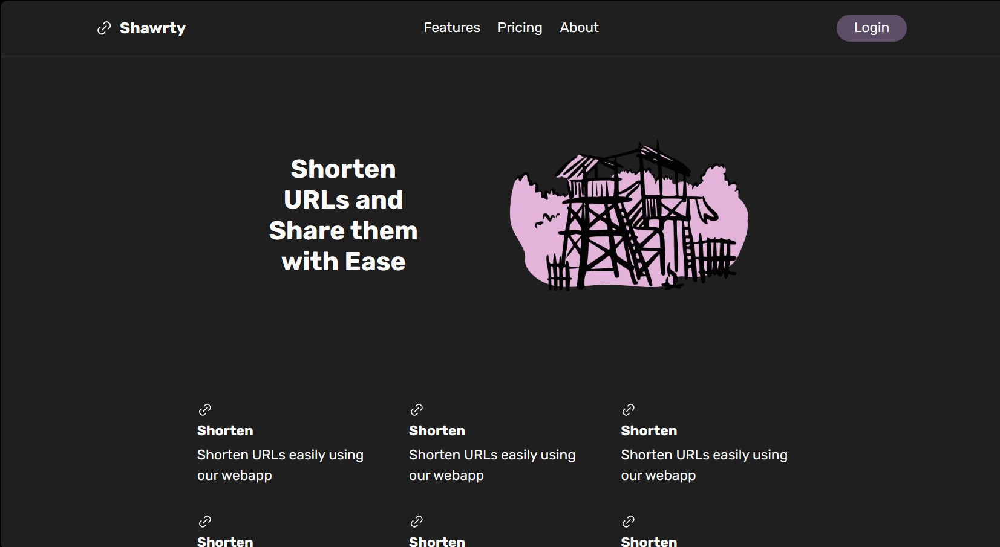
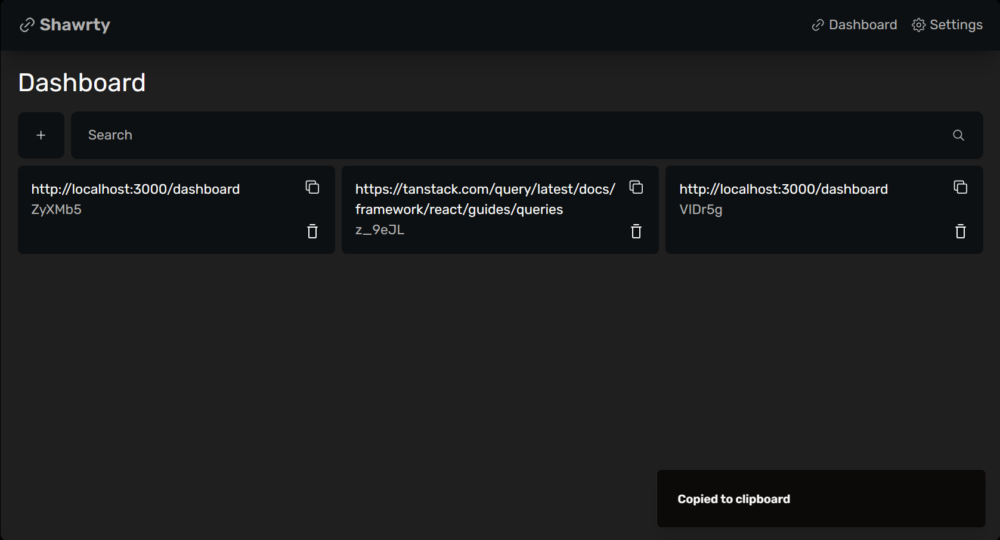

# Shawrty

### The What

Shawrty is a URL Shortener built using (M*)ERN Stack. [* Uses Prisma ORM using sqlite, but migrating to mongo using Prisma is a simple task].

### The Why

This was purely built as a proof of concept of my capabilities making a full stack (M\*)ERN app, as this is not really a novel concept.

### Tech Stack

- Next.js
- Node with Express.js
- Prisma
- Tanstack/React Query
- Redux Store w/ Persist
- Cookie (& Optionally Token) authentication

### Features

There are a few features that are left to implement (which maybe never will be completed as this is purely a Proof of Concept)

#### Client

- [x] Login
- [ ] Sign Up
- [x] Shorten URL
- [x] Delete Shortened URL
- [x] Copy Shortened URL
- [ ] Edit Shortened URL
- [x] Redirect to Original URL
- [ ] Settings Page

#### Server

- [x] Login
- [x] Signup
- [x] Shorten URL
- [x] Delete Shortened URL
- [x] Copy Shortened URL
- [ ] Edit Shortened URL

### Run It Yourself

#### Client

- `cd client`
- `npm i`
- `npm run dev`

#### Server

- `cd server`
- `npm i`
- `npm run dev`
